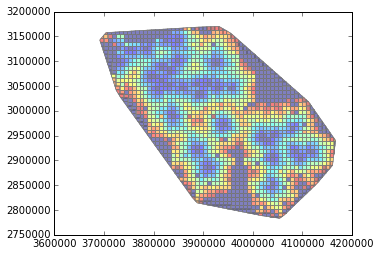
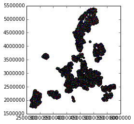
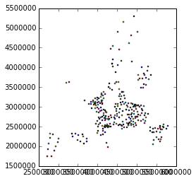
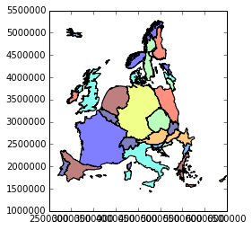
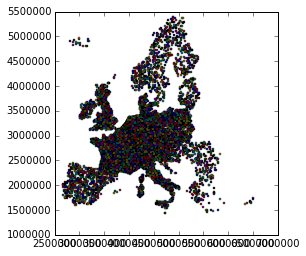
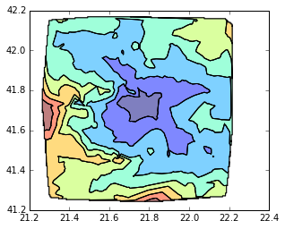
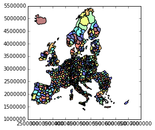
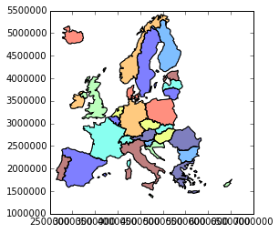
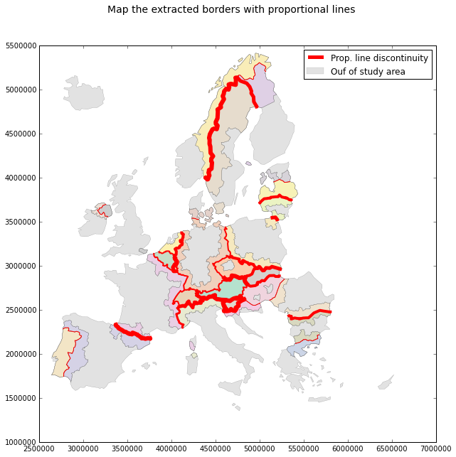

### gpd_lite_toolboox
Mini toolbox using geopandas/GeoDataFrame and providing some convenience functions. 
(read from spatialite, snap points on lines/polygons, match linestring segments, make continous cartogram or non-contiguous cartogram, dissolve or explode a layer, compute weighted mean coordinates, etc.) 

**More a testing repo than a real package repository**

Installation
------------
```shell
git clone https://github.com/mthh/gpd_lite_toolbox.git
cd gpd_lite_toolbox/
python setup.py install

```

Requierments
------------
- geopandas
- cython


Demo
----

```python

In [1]: # Import some basics :
   ...: import geopandas as gpd
   ...: import numpy as np
   ...: import matplotlib.pyplot as plt
   ...: %matplotlib inline
   ...: 
   ...: # Import the functions presented here :
   ...: import gpd_lite_toolbox as glt
   ...: 
   ...: # and also some slightly modified functions from geopandas.plotting :
   ...: from gpd_lite_toolbox.utils_carto import m_plot_dataframe, m_plot_multipolygon
   ...: 
   ...: path_points = 'pts_umz_3600s.shp'
   ...: path_grid = 'grid_pop.shp'
   ...: path_country = 'eu32_poids.shp'
   ...: 
   ...: gdf_points = gpd.read_file(path_points).to_crs(epsg=3035)
   ...: gdf_grid_pop = gpd.read_file(path_grid)
   ...: gdf_country = gpd.read_file(path_country)
   ...: 
```
#### Gridify your (points) data :

```python

In [3]: grid = glt.gridify_data(gdf_points, 8000,
   ...:     'time', method=np.min)  # Choose a method to aggregate point values in each grid cell
   ...: 
   ...: m_plot_dataframe(grid, column='time', contour_poly_width=0.5, edgecolor="grey")
   ...: 
Out[3]: <matplotlib.axes._subplots.AxesSubplot at 0x7fae5f6dbd30>
```



#### Compute the weighted mean coordinates of a collection of categorized points

```python
In [4]: gdf_grid_pop.geometry = gdf_grid_pop.geometry.centroid
   ...: gdf_grid_pop.plot()
   ...: 
Out[4]: <matplotlib.axes._subplots.AxesSubplot at 0x11c88b00>
```


```python
In [5]: mean_coord = glt.mean_coordinates(gdf_grid_pop, id_field='ID_N_sup', weight_field='TOT_P')
   ...: mean_coord.plot()
   ...: 
Out[5]: <matplotlib.axes._subplots.AxesSubplot at 0x75fcb8d0>
```



#### Make a continous cartogram (Dougenik & al. algorithm)

```python
In [6]: cartogram = glt.transform_cartogram(gdf_country, 'SIZE(MB)', 5, inplace=False)
   ...: cartogram.plot()
   ...: 
Out[6]: <matplotlib.axes._subplots.AxesSubplot at 0x64da9b70>
```



#### Display some random points on the surface of polygons (based, or not, on a numerical field)

```
In [7]: rand_pts = glt.random_pts_on_surface(gdf_country, coef=1, nb_field='SIZE(MB)')
   ...: # Coef define a fixed number of points per polygon, which can be multiplied by a value for each polygon.
   ...: rand_pts.plot()
   ...: 
Out[7]: <matplotlib.axes._subplots.AxesSubplot at 0x6f025d68>
```



#### Compute accessibility isocrones from an OSRM local instance

```
In [11]: %%capture
    ...: iso_poly, grid, pt = glt.access_isocrone((21.8, 41.77),
    ...:     precision=0.024, size=0.45, host='http://localhost:5000')
    ...: 

In [12]: iso_poly.plot()
Out[12]: <matplotlib.axes._subplots.AxesSubplot at 0x82ad2cf8>

```


#### Dissolve a layer according to a field

```python
In [13]: gdf_n23 = gpd.read_file('eu32_n23G.shp')
    ...: gdf_n23.plot()
    ...: 
Out[13]: <matplotlib.axes._subplots.AxesSubplot at 0x16435588>
```


```python
In [14]: gdf_cntr = glt.dissolve(gdf_n23, colname='country')
    ...: gdf_cntr.plot()
    ...: 
Out[14]: <matplotlib.axes._subplots.AxesSubplot at 0x1bb13898>
```



#### Extract the border line between polygons
**_(and get nearby polygons attributes on the extracted border polylines)_**

```python
In [15]: gdf_border = glt.find_borders(gdf_cntr, tol=5, col_name='country')
```
##### And plot them, according to a numerical field (for mapping borders discontinuity for example) : 

```python
In [16]: # Fisrt preparing some other layer to plot with : 
    ...: gdf_n23.transfront = gdf_n23.transfront.astype(float)
    ...: gdf_country_selec = glt.dissolve(gdf_n23[gdf_n23.transfront == 1], 'country')
    ...: 
    ...: # Generate some fake values to use as border discontinuity values :
    ...: from random import randint
    ...: vals = [randint(1,6) for i in range(len(gdf_border))]
    ...: gdf_border['val'] = vals
    ...: fig, ax = plt.subplots(figsize=(10, 10))
    ...: 
    ...: # Use the modified plotting functions from geopandas :
    ...: from shapely.ops import unary_union
    ...: m_plot_multipolygon(ax, unary_union(gdf_cntr.geometry.values),
    ...:                     linewidth=0.1, facecolor='lightgrey',
    ...:                     edgecolor='grey', alpha=0.65)
    ...: m_plot_dataframe(gdf_country_selec, alpha=0.95, edgecolor='grey',
    ...:                  contour_poly_width=0.2, column='country',
    ...:                  colormap="Pastel2", axes=ax)
    ...: 
    ...: # Make proportional lines :
    ...: glt.make_prop_lines(gdf_border, 'val', axes=ax, normalize_values=False)
    ...: 
    ...: # And draw a very basic legend :
    ...: ax.patches[0]._label = "Ouf of study area"
    ...: ax.lines[164]._label = "Prop. line discontinuity"
    ...: ax.legend(handles=[ax.lines[164], ax.patches[0]], loc=1)
    ...: fig.suptitle("Map the extracted borders with proportional lines",
    ...:              size=14)
    ...: 
Out[16]: <matplotlib.text.Text at 0x21bf8828>
```


